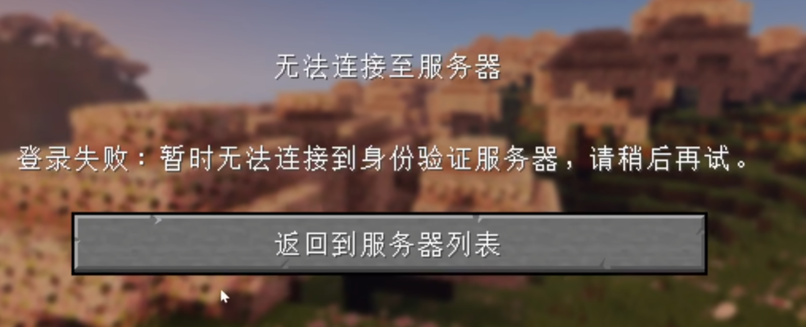

---
title: 常见问题
description: BlockTavern 常见问题解答
tags:
  - FAQ
  - 帮助
---

# 常见问题 FAQ

欢迎来到 BlockTavern 的常见问题页面！这里收集了玩家们最常遇到的问题和解答。

---

## 如何加入服务器？

请参考我们的 [安装教程](../InstallationTutorial/installation-details.md)。

### 服务器地址是什么？

!!! info "服务器地址"
    服务器地址已经打包在游戏内，无需手动输入。

### 服务器支持哪些版本？

!!! tip "版本要求"
    目前仅支持 **Java 版 1.21** 系列版本。

### 可以建造什么？

在遵守服务器规则的前提下，您可以自由建造。详情请查看 [服务器规则](../GameplayGuide/server-rules.md)。

### 连接不上服务器、延迟高？

!!! warning "网络问题排查"
    1. 检查自身网络是否卡顿
    2. 是否开启了 VPN 等代理工具
    3. 服务器是优选线路，通常延迟较低
    
    如果自身网络无问题，建议联系服务器管理员。

---

## 无法验证身份服务器

**问题描述：**

| 错误信息 | 解决方案 |
|---------|---------|
| 登录失败：暂时无法连接到身份验证服务器，请稍后再试 | 使用 UsbEAm Hosts Editor 修复 |

**解决步骤：**

1. 下载 [UsbEAm Hosts Editor](https://www.dogfight360.com/blog/18627/)
2. 参考 [B站视频教程](https://www.bilibili.com/video/BV16tejetEUH/)
3. 按照视频说明修改 Hosts 文件

---

## 退出游戏崩溃

!!! bug "已知问题"
    由于 Minecraft 1.21 版本的注册表问题，部分玩家在退出游戏时可能会遇到客户端崩溃的情况。目前暂时无法完全修复。

**解决方案：**

!!! success "推荐做法"
    - 直接关闭游戏窗口
    - 或者使用 ++alt+f4++ 快捷键强制退出游戏
    - 避免触发崩溃报告

---

## 还有问题？

如果以上内容无法解决您的问题，请通过以下方式联系我们：

- [GitHub Issues](https://github.com/Re0XIAOPA/doc_blocktavern/issues)
- 在游戏内联系管理员

