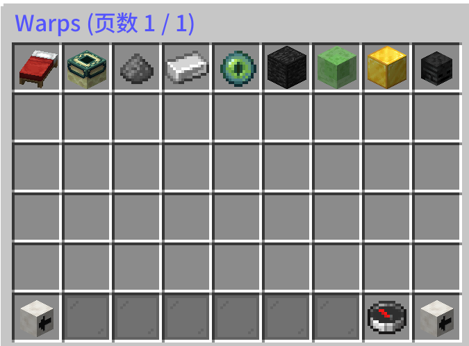
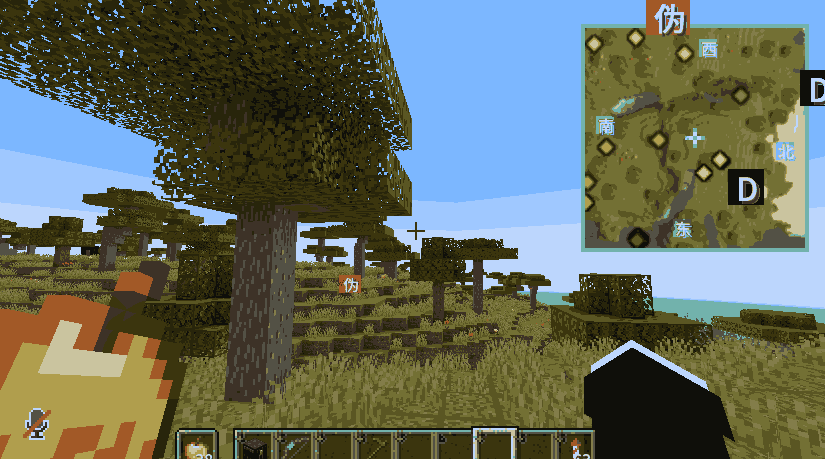
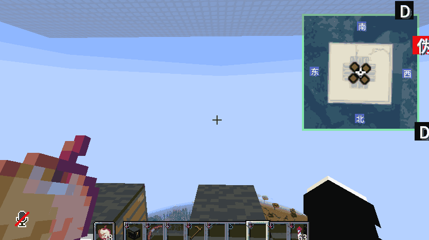
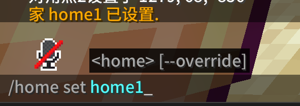
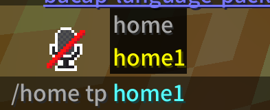
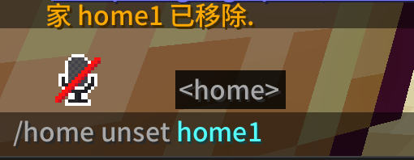
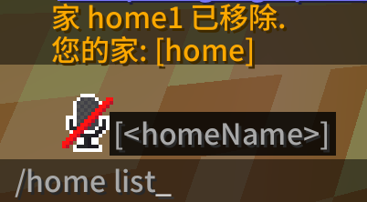

---
title: 指令列表
description: BlockTavern 服务器常用指令
tags:
  - 指令
  - 服务器
---

# 基本指令

以下是服务器中常用的指令列表。

---

## warp - 服务器公共地标

**指令：** `/warp`

**功能：** 传送到服务器公共地标

**使用方法：**

1. 输入 `/warp` 查看所有可用地标
2. 输入 `/warp <地标名>` 传送到指定地标

**示例：**

---

## back - 返回上一次的位置

**指令：** `/back`

**功能：** 返回上一次传送前的位置

**使用方法：**

- 输入 `/back` 返回上次位置

**示例：**

| 当前位置 | 上次位置 |
|---------|---------|
|  |  |

---

## tpa - 请求传送

**指令：** `/tpa <玩家名>`

**功能：** 请求传送到其他玩家

**使用方法：**

1. 输入 `/tpa <玩家名>` 发送传送请求
2. 对方会收到请求提示
3. 对方可以接受或拒绝

**相关指令：**

| 指令 | 功能 |
|-----|------|
| `/tpa <玩家名>` | 发送传送请求 |
| `/tpaccept` | 接受传送请求 |
| `/tpadeny` | 拒绝传送请求 |

**示例：**

| 发送请求 | 接受/拒绝 |
|---------|----------|
|  |  |

---

## home - 家园系统

### 设置家园

**指令：** `/sethome <名称>`

**功能：** 设置当前位置为家园

**示例：**

### 传送回家园

**指令：** `/home <名称>`

**功能：** 传送到指定家园

**示例：**

### 删除家园

**指令：** `/delhome <名称>`

**功能：** 删除指定家园

**示例：**

### 查看家园列表

**指令：** `/homelist`

**功能：** 查看所有已设置的家园

**示例：**

---

## 其他常用指令

| 指令 | 功能 |
|-----|------|
| `/spawn` | 返回出生点 |
| `/msg <玩家名> <消息>` | 私聊 |
| `/r <消息>` | 回复私聊 |
| `/help` | 查看帮助 |

