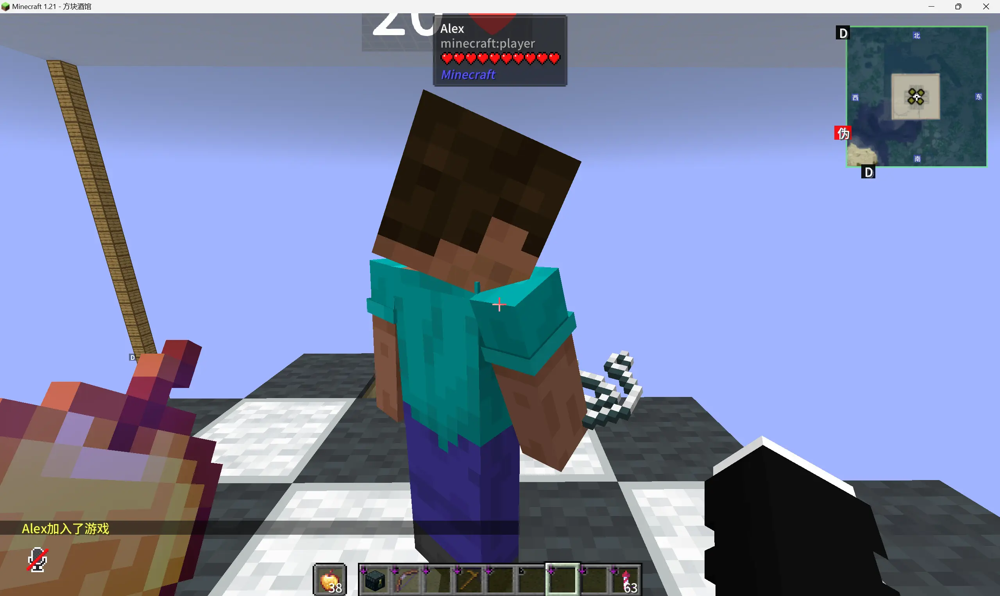
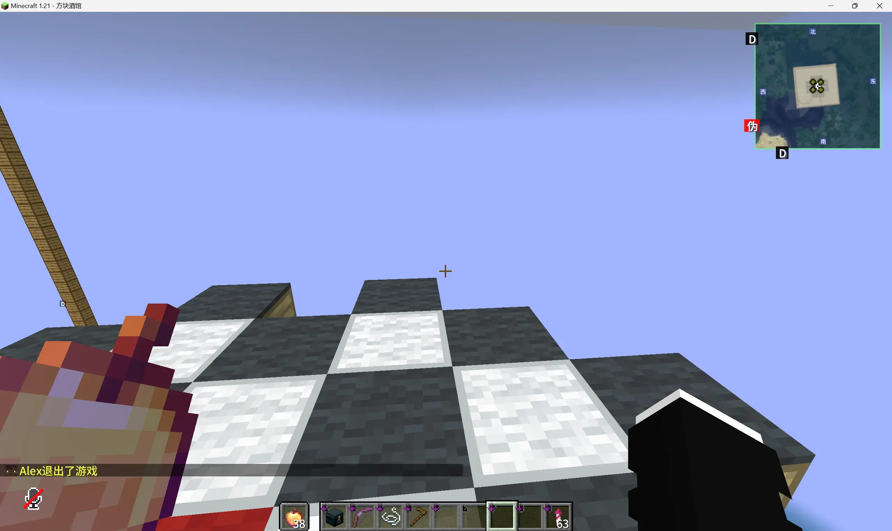

---
title: 假人指令
description: BlockTavern 假人系统指令
tags:
  - 假人
  - 指令
---

# 假人指令

BlockTavern 加入了假人指令，玩家可以模拟出多个假的玩家，进行一些游戏测试。

---

## 生成假人

**指令：** `/player <name> spawn`

**功能：** 生成一个假人玩家

**使用方法：**

1. 输入 `/player <名称> spawn`
2. 假人会出现在你当前的位置
3. 假人可以用于挂机、测试等

**示例：**

---

## 删除假人

**指令：** `/player <name> kill`

**功能：** 删除指定的假人

**使用方法：**

1. 输入 `/player <名称> kill`
2. 假人会被移除

**示例：**

---

## 指令汇总

| 指令 | 功能 |
|-----|------|
| `/player <name> spawn` | 生成假人 |
| `/player <name> kill` | 删除假人 |

---

## 使用场景

!!! tip "使用场景"
    - **挂机农场**：生成假人保持区块加载
    - **测试红石**：用假人测试机器是否正常工作
    - **多人测试**：测试需要多人参与的机制

---

## 注意事项

!!! warning "注意事项"
    - 假人会占用服务器资源，不要生成过多
    - 假人断开后会自动消失
    - 不要用假人进行作弊行为

