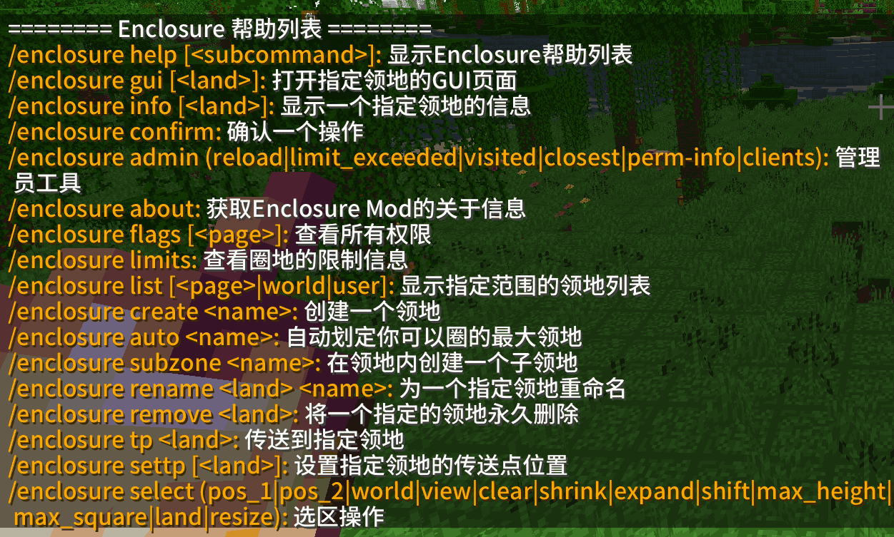
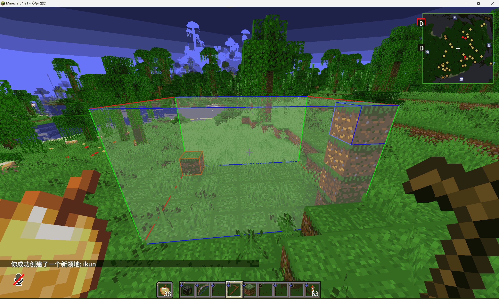
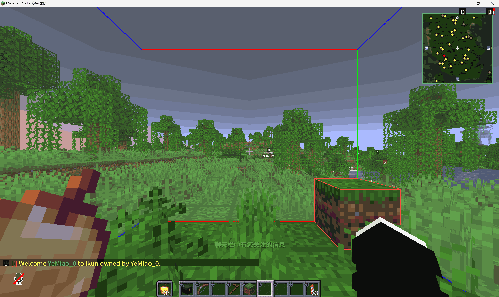
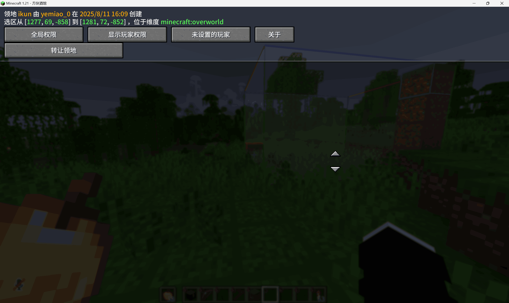

---
title: 领地指令
description: BlockTavern 领地系统指令
tags:
  - 领地
  - 指令
---

# 领地指令

BlockTavern 加入了 Enclosure 领地系统，玩家可以使用木锄头来为自己建立保护罩，以防止其他玩家破坏。

玩家可以在领地内设置一些基本的属性，例如名称、访问权限等。

!!! tip "提示"
    如果你没有 GUI 显示，那么你需要下载此 Enclosure MOD：[点击下载](../assets/images/GameplayGuide/enclosure-order/[领地]enclosure-fabric-0.4.5+1.21.jar)
    
    放至 mods 文件夹并重启游戏。

---

## 准备工作

领地需要使用 **木锄** 选择对角点，然后使用指令创建领地。

---

## 基本指令

### 查看帮助

**指令：** `/enclosure help`

**功能：** 查看所有可用的领地指令

---

### 创建领地

**指令：** `/enclosure create <名称>`

**功能：** 创建一个新的领地

**使用方法：**

1. 使用木锄选择第一个对角点（左键）
2. 使用木锄选择第二个对角点（右键）
3. 输入 `/enclosure create <名称>` 创建领地

---

### 传送到领地

**指令：** `/enclosure tp <名称>`

**功能：** 传送到指定领地

---

### 查看领地列表

**指令：** `/enclosure list`

**功能：** 查看所有已创建的领地

---

### 设置领地

**指令：** `/enclosure set`

**功能：** 设置领地属性

---

### 打开领地 GUI

**指令：** `/enclosure gui`

**功能：** 打开领地管理界面

---

### 查看领地信息

**指令：** `/enclosure info`

**功能：** 查看当前领地的详细信息

---

### 删除领地

**指令：** `/enclosure remove <名称>`

**功能：** 删除指定领地

---

## 指令汇总

| 指令 | 功能 |
|-----|------|
| `/enclosure help` | 查看帮助 |
| `/enclosure create <名称>` | 创建领地 |
| `/enclosure tp <名称>` | 传送到领地 |
| `/enclosure list` | 查看领地列表 |
| `/enclosure set` | 设置领地属性 |
| `/enclosure gui` | 打开管理界面 |
| `/enclosure info` | 查看领地信息 |
| `/enclosure remove <名称>` | 删除领地 |

---

## 注意事项

!!! warning "注意事项"
    - 领地大小有限制，请合理规划
    - 不要与其他玩家的领地重叠
    - 领地内可以设置允许访问的玩家

