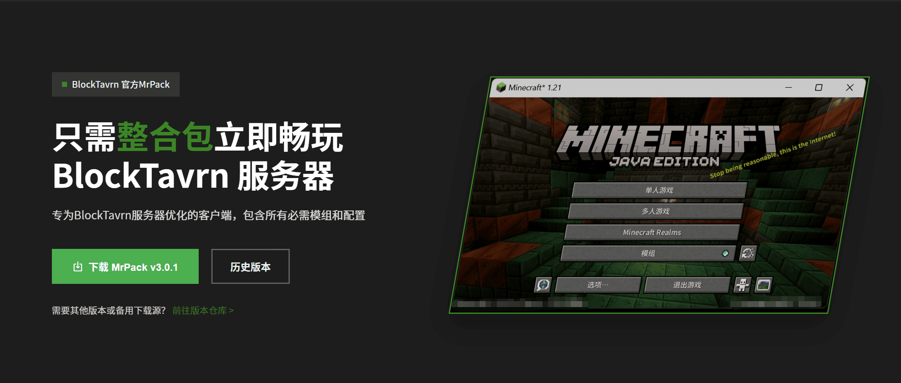
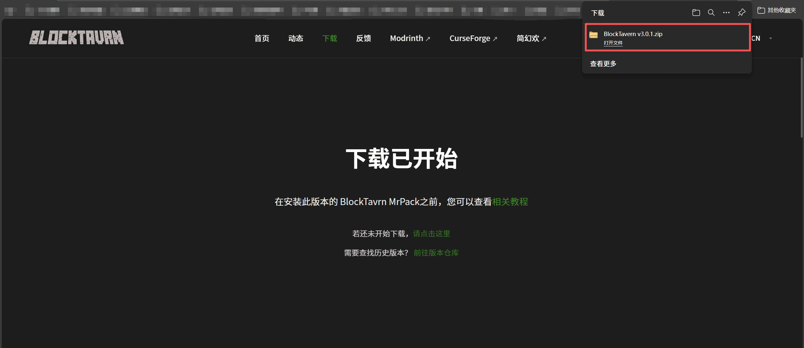

---
title: 安装前准备
description: BlockTavern 游戏安装前的准备工作
tags:
  - 安装
  - 教程
---

# 安装前准备

欢迎来到 BlockTavern！本教程将帮助您正确安装和配置 Minecraft，以便顺利加入我们的服务器。

---

## 系统要求

在开始安装之前，请确保您具备以下条件：

!!! abstract "必要条件"
    - **Java 17+** - 游戏运行环境
    - **Minecraft 启动器** - 不推荐官方启动器

---

## 第一步：安装 Java

### Java 17 或更高版本

| 站点 | JDK 版本 | 下载链接 | 备注 |
|------|---------|---------|------|
| huang1111 网盘 | 17 | [下载](https://pan.huang1111.cn/s/k25RDcB) | :material-check-circle:{ .md-color--green } **推荐** - 无需登录 |
| Zoho workdrive | 17 | [下载](https://workdrive.zohopublic.com.cn/file/w86hse521f910525543b9aee2a0b5fbd5af4d) | 无需登录下载 |
| 123 云盘 | 17 | [下载](https://www.123684.com/s/92S0Vv-iVGld) | 需要登录下载 |
| Oracle | 17 | [下载](https://www.oracle.com/java/technologies/downloads/#java17-windows) | 需要登录下载 |
| Adoptium | 17 | [下载](https://adoptium.net/zh-CN/temurin/releases?version=17&os=any&arch=any) | 无需登录但速度稍慢 |

!!! warning "已失效"
    小飞机网盘链接已失效，请使用其他下载源。

!!! tip "安装提示"
    安装 Java 时，建议使用默认安装路径，避免中文目录。

---

## 第二步：安装游戏启动器

### 推荐启动器

| 启动器 | 下载链接 | 备注 |
|-------|---------|------|
| **PCL2 启动器** | [下载](https://afdian.com/p/0164034c016c11ebafcb52540025c377) | :material-check-circle:{ .md-color--green } **推荐** |
| **HMCL 启动器** | [下载](https://hmcl.huangyuhui.net/download/) | :material-check-circle:{ .md-color--green } **推荐** |
| Modrinth 启动器 | [下载](https://modrinth.com/app) | 需正版登录 |
| 官方启动器 | [下载](https://www.minecraft.net/zh-hans/download) | :material-close-circle:{ .md-color--red } 不推荐 |

!!! info "启动器选择"
    - **PCL2**：界面简洁，适合新手
    - **HMCL**：功能强大，支持多版本管理
    
---

## 第三步：下载游戏

### 下载在线游戏安装包

[:material-download: 前往下载](https://www.blocktavern.cn/download){ .md-button .md-button--primary }

**下载步骤：**

1. 访问 [BlockTavern 官网](https://www.blocktavern.cn/download)
2. 点击下载按钮
3. 保存安装包到本地

**安装文件：**

下载完成后，您将得到一个安装文件：

---

## 下一步

安装完成后，请根据您选择的启动器继续：

| 启动器 | 教程链接 | 推荐程度 |
|-------|---------|---------|
| **PCL2 启动器** | [查看教程](pcl2-installation.md) | :material-star:{ .md-color--green } :material-star:{ .md-color--green } :material-star:{ .md-color--green } |
| **HMCL 启动器** | [查看教程](hmcl-installation.md) | :material-star:{ .md-color--green } :material-star:{ .md-color--green } |

---

## 遇到问题？

!!! question "需要帮助？"
    如果您在安装过程中遇到问题，请查看：
    
    - [常见问题 FAQ](../FAQ/faq-details.md)
    - [GitHub Issues](https://github.com/Re0XIAOPA/doc_blocktavern/issues)

