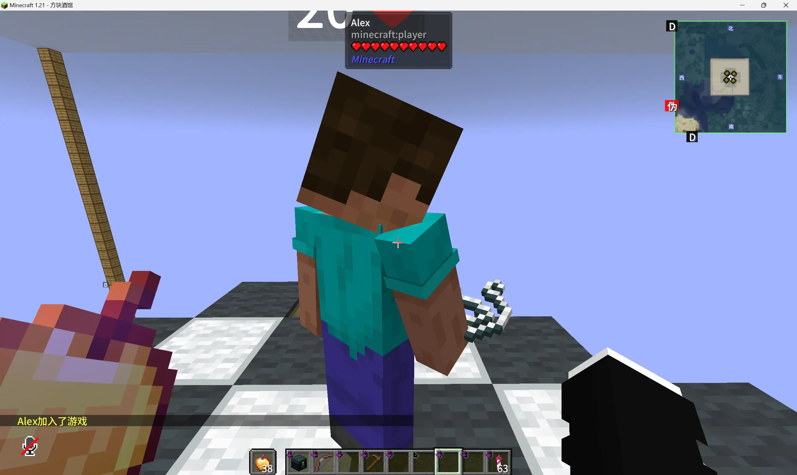
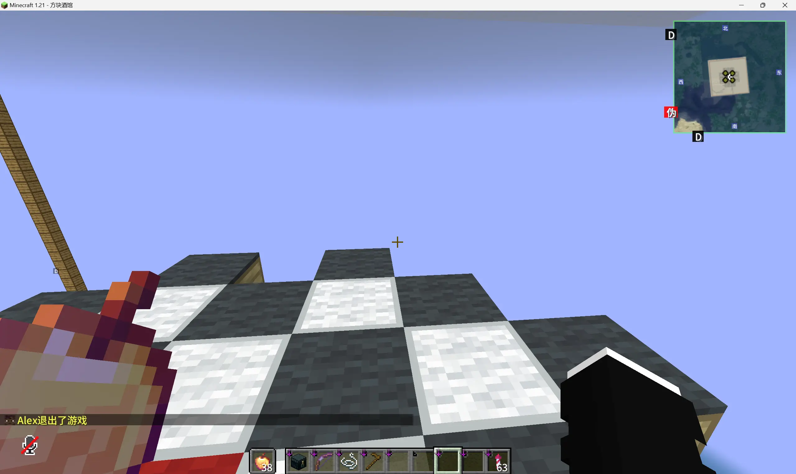

# 假人指令

BlockTavern 加入了假人指令，玩家可以模拟出多个假的玩家，进行一些游戏测试。

## 指令列表

| 指令 | 描述 |
| --- | --- |
| /player \<name\> spawn | 生成假人 |
|  |  |
| /player \<name\> kill | 删除假人 |
|  |  |

<Contributors />

<GitHistoryInformation />