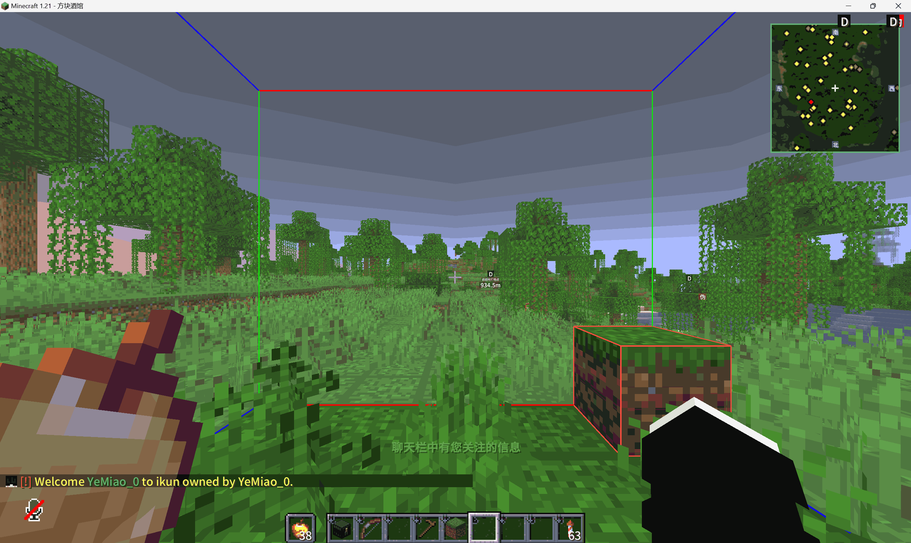

# 领地指令
BlockTavern 加入了 Enclosure 领地，玩家可以使用木锄头来为自己建立保护罩，以防止其他玩家破坏。玩家可以在领地内设置一些基本的属性，例如名称，访问权限等。

::: tip 提示
如果你没有GUI显示，那么你需要下载此MOD：[Enclosure](./enclosure-order/[领地]enclosure-fabric-0.4.5+1.21.jar)
放至mods文件夹并重启动游戏。
:::

## 指令
| 指令 | 描述 |
| --- | --- |
| /enclosure help | 领地帮助 |
|  |  |
| /enclosure tp | 传送至领地 |
|  |  |
| /enclosure list | 领地列表 |
|  |  |
| /enclosure create | 创建领地 |
|  |  |
| /enclosure remove | 删除领地 |
|  |  |
| /enclosure set | 设置领地属性 |
|  |  |
| /enclosure info | 查看领地信息 |
|  |  |

<Contributors />