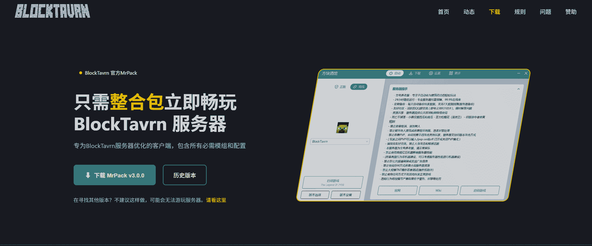
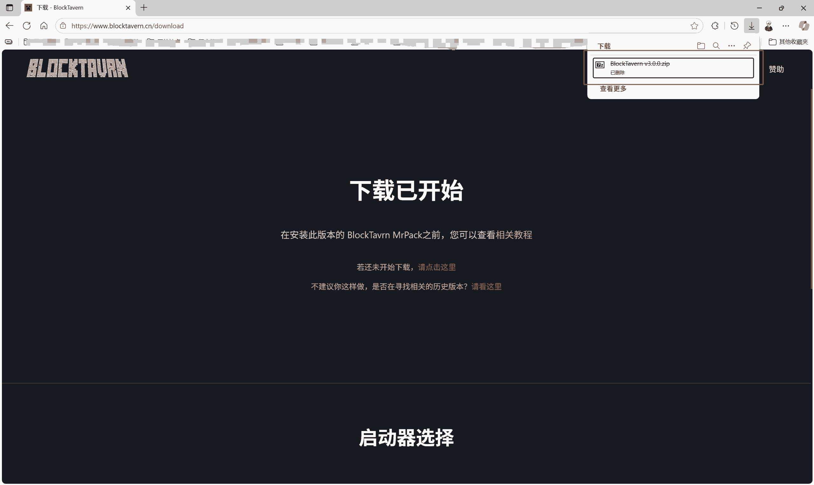
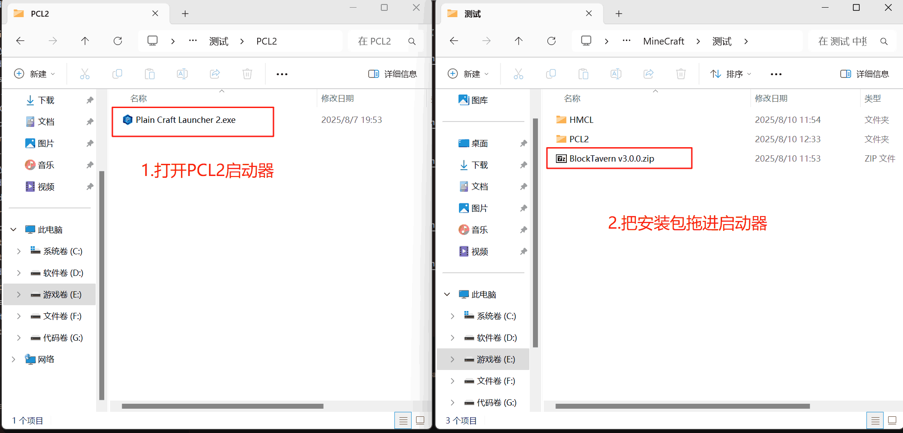
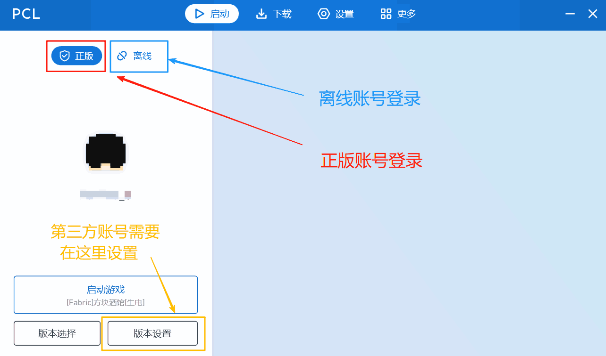

# 安装教程

欢迎来到BlockTavern！本教程将帮助您正确安装和配置Minecraft，以便顺利加入我们的服务器。

在开始安装之前，请确保您具备以下条件：

**1. Java 17 或更高版本**

   | 站点 | JDK版本 | 下载链接 | 备注 |
   | --- | --- | --- | --- |
   | Zoho workdrive | 17 | [下载](https://workdrive.zohopublic.com.cn/file/w86hse521f910525543b9aee2a0b5fbd5af4d) | 无需登录下载
   | 小飞机网盘 | 17 | [下载](https://share.feijipan.com/s/sxOQO9u7) | 无需登录下载 |
   | 123云盘 | 17 | [下载](https://www.123684.com/s/92S0Vv-iVGld) | [备用链接](https://www.123912.com/s/92S0Vv-iVGld)  需要登录下载|
   | [Oracle](https://www.oracle.com/cn/) | 17 | [下载](https://www.oracle.com/java/technologies/downloads/#java17-windows) | 需要登录下载 |
   | [Adoptium](https://adoptium.net/zh-CN/) | 17 | [下载](https://adoptium.net/zh-CN/temurin/releases?version=17&os=any&arch=any) | 无需登录但速度稍慢 |

**2. 下载启动器**

| 启动器 | 链接 | 备注 |
| --- | --- | --- |
| 官方启动器 | [下载](https://www.minecraft.net/zh-hans/download) | 不推荐 |
| PCL2启动器 | [下载](https://afdian.com/p/0164034c016c11ebafcb52540025c377) | 推荐 |
| HMCL启动器 | [下载](https://hmcl.huangyuhui.net/download/) | 推荐 |
| Modrinth启动器 | [下载](https://modrinth.com/app) | 需正版登录 |

**下载在线游戏安装包**

下载我们的最新版安装包：[前往下载](https://www.blocktavern.cn/download)

你就会得到一个安装文件，接下来就可以安装它了。

**PCL2一键安装（推荐）**

## 获取帮助

如果您在安装过程中遇到问题：

1. 查看[常见问题FAQ](/zh-CN/FAQ/)
2. 联系服务器管理员
3. 在社区论坛发帖求助
4. 加入官方QQ群或Discord

---

安装完成后，别忘了阅读[游戏指南](/zh-CN/GameplayGuide/)来了解服务器的特色玩法！